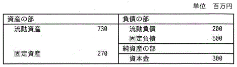

## 令和8年度 問26 (ストラテジ系)

表はA社の貸借対照表である。A社の自己資本比率は何%か。
  

<ol class="aiueo" >
  <li class="ans">ASP</li>
  <li>ISP</li>
  <li>アウトソーシング</li>
  <li>データウェアハウス</li>
</ol>

***

<ol class="aiueo" >
  <li class="ans">ASP（Application Service Provider）。身近な例では、Webメールやオンラインストレージ、スケジュール管理などがある。</li>
  <li>ISP（Internet Service Provider）は、インターネット接続サービスを提供する事業者。  >> p.485</li>
  <li>アウトソーシング（outsourcing）は、業務の一部を外部の専門業者に委託する手法。 >> p.108  H22f, H25s, H26f</li>
  <li>データウェアハウス（Data warehouse, DWH）は、データの倉庫を意味し、経営や業務の意思決定に役立てるためのデータの集まりである。各種データベースから抽出した情報を統合して分析する。 >> p.198　 H22s, H24s, H29s, R5</li>
</ol>
